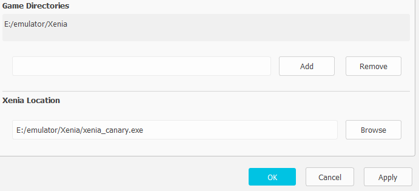

# Canary Launcher

Xenia Canary is an outstanding Xbox 360 emulator - on the technical side. What it lacks, however, is a useful user interface. To run a particular game you can either drag & drop a file, click 'open' or browse the 'recently used' list.

This is where **Canary Launcher** comes in. It scans given directories for available Xbox 360 media and presents the results in a nifty list - ready to be started.

## Features

- Detect Xbox 360 games in .iso, .xex, .zar and xcontent files
- Custom configuration of individual games independent of *xenia-canary.config.toml*
- Ryujinx-inspired user interface with a dark and a light color theme

## Requirements

- Windows 7+
- [Xenia Canary](https://github.com/xenia-canary/xenia-canary)
- Eventually [Visual C++ 2019 Redistributables](https://learn.microsoft.com/en-us/cpp/windows/latest-supported-vc-redist?view=msvc-170)

## Usage

1. Pick **Options** -> **Settings** from the menu bar

2. Choose your ROM folder(s)

3. Tell it where to find xenia_canary.exe

4. Hit Okay

5. Hit refresh

## Advanced Usage

Say you have a game that offers additional languages and your Xenia Canary is set to 'English'. Usually that's a good choice but you want that particular game's language to be 'Spanish'. To switch languages, you'd have to manually edit Canary's config file like:

`user_language = 5`

Canary Launcher eases the pain by allowing to set game-specific overrides. To do this, right-click that particular game.

From the drop-down box select **user-language**, enter **5** in the field right beside and hit **Add**.

## Final Notes

At the moment this project is closed-source so the release consists of the windows-executable only. If there's interest and the need to I might make it open-source.

This project is not affiliated with Xenia Canary.